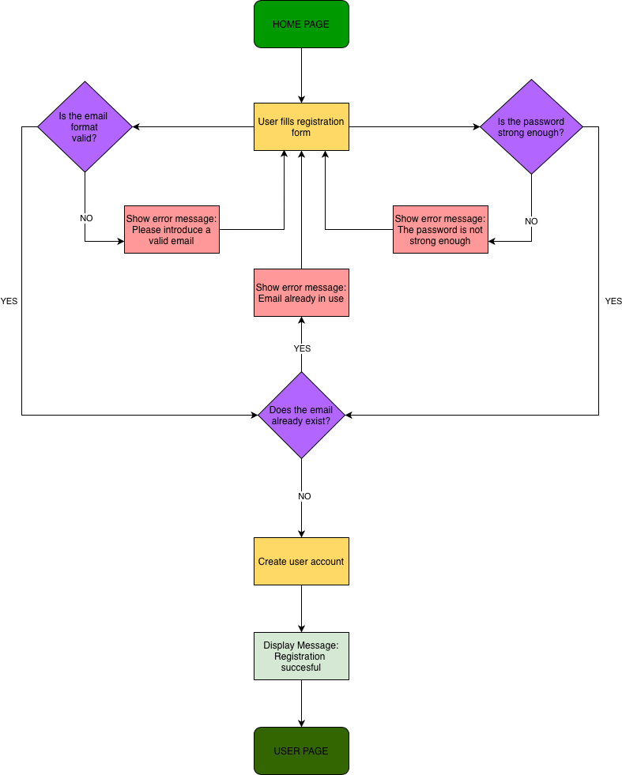
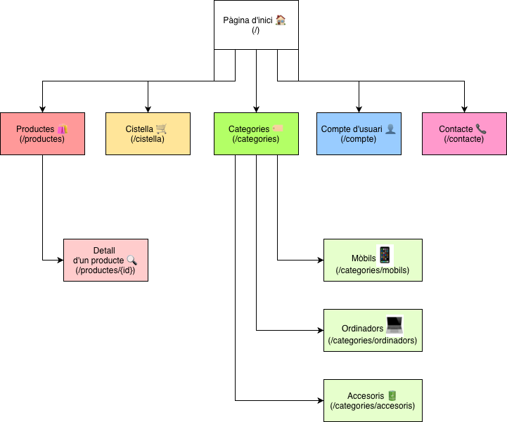

# **Fonaments del Disseny Lògic i l'Arquitectura d'Interacció**

El disseny d'una aplicació web requereix una planificació rigorosa de com es comunica la informació entre les capes del sistema i com l'usuari navega per elles. Entendre la distinció entre l'estructura de dades, la lògica del sistema i l'experiència de l'usuari és clau per evitar errors abans de la fase de codificació.

## **1\. Flux Lògic i Interacció Frontend-Backend**

Un flux lògic es compon de diverses capes que han de treballar en sintonia per processar les accions de l'usuari:

* **Frontend (Client-side)**: És la part visible on l'usuari interacciona amb elements de la interfície (clics, formularis). El seu rol és capturar l'acció i enviar una petició HTTP (via AJAX o WebSockets) al servidor.  
* **Middleware / API Gateway**: Actua com a intermediari. Gestiona la seguretat (autenticació/autorització), el filtratge de peticions i l'encaminament cap als microserveis o el backend corresponent.  
* **Backend (Server-side)**: Rep la petició, interpreta la lògica de negoci, realitza càlculs i consulta la **Base de Dades** si és necessari per obtenir o guardar informació.

**Cicle de petició-resposta**: El frontend demana dades a través d'una API, el backend les processa i retorna una resposta (normalment en format JSON) que el frontend interpreta per actualitzar la interfície sense haver de recarregar la pàgina.

## **2\. Sitemap vs. User Journey Map: Quan fer servir cadascun?**

Tot i que ambdós ajuden al disseny d'UX, la seva finalitat i escala són diferents:

| Eina | Objectiu Principal | Escenari d'Ús |
| :---- | :---- | :---- |
| **Sitemap** | Estructura jeràrquica i arquitectura de continguts. | Útil quan cal definir la **jerarquia de pàgines**, l'organització de la informació a escala macro o el mapa de navegació global. |
| **User Journey Map** | Experiència narrativa i emocional de l'usuari. | Útil quan cal analitzar els **punts de fricció**, les emocions i les interaccions des de la perspectiva d'una *persona* específica per assolir un objectiu. |

**Conclusió**: Prioritza el **Sitemap** en les fases inicials de planificació per establir el "què" i l'ordre del lloc. Fes servir el **User Journey Map** per entendre el "com" i el "per què" de l'experiència de l'usuari.

## **3\. Diagrames UML vs. ERD en el Disseny d'Aplicacions**

L'elecció entre UML i ERD depèn de si estem modelant la funcionalitat del programari o l'emmagatzematge de les dades:

* **UML (Unified Modeling Language)**: És un llenguatge visual per descriure **tot el sistema de programari**. Inclou diagrames d'estructura (com el de Classes) i de comportament (com els d'Activitat o Seqüència). S'utilitza per definir la lògica d'execució i la interacció entre objectes.  
* **ERD (Entity Relationship Diagram)**: Es focalitza exclusivament en el **disseny de la base de dades**. Modela les entitats (taules), els seus atributs (camps) i les relacions entre elles (1:1, 1:N, N:N).

**Diferència clau**: Mentre l'UML pot descriure el pas del temps i l'estat d'una acció, l'ERD és estàtic i només descriu l'organització lògica de les dades.

## **4\. Eines de Diagramació: Visuals vs. Code-First**

L'elecció de l'eina influeix en l'agilitat del projecte:

* **Eines Visuals (ex: Figma, Draw.io, Lucidchart)**: Ofereixen gran llibertat creativa i són excel·lents per a la col·laboració en temps real amb perfils no tècnics. Són ideals per a dissenys complexos que requereixen una estètica polida.  
* **Eines Code-First (ex: Mermaid.js)**: Permeten generar diagrames escrivint codi senzill (similar a Markdown). Són molt eficaces per a projectes web perquè permeten **integrar els diagrames directament en la documentació** del repositori (com a VS Code), facilitant el manteniment i el control de versions.

## **5\. Elements Clau del User Flow per Anticipar Problemes d'UX**

Per identificar punts de fricció abans de programar, un **User Flow** ha d'incloure:

* **Selectors i Punts d'Entrada**: Identificar on comença l'usuari i amb quins elements interacciona exactament.  
* **Execució Condicional**: Definir clarament els camins alternatius (ex: què passa si el login falla? i si l'usuari és de pagament o gratuït?).  
* **Bucles i Repeticions**: Anticipar escenaris on l'usuari ha de repetir accions fins que es compleixi una condició.  
* **Punts de Sortida i Objectius**: El flux ha d'acabar quan l'usuari assoleix el seu objectiu o abandona el sistema.

Incloure aquests detalls permet estalviar hores de depuració en detectar on l'usuari es pot sentir perdut o on el sistema pot oferir una resposta inesperada abans d'escriure una sola línia de codi.

## Tasca S0.08 - Registre d'usuaris

## Tasca S0.09 - Botiga Online

