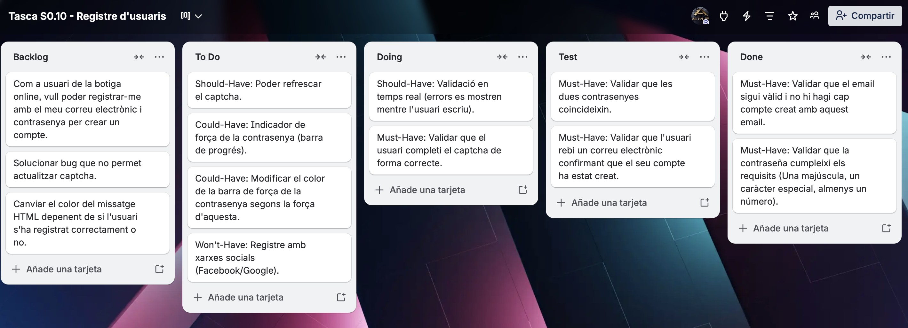
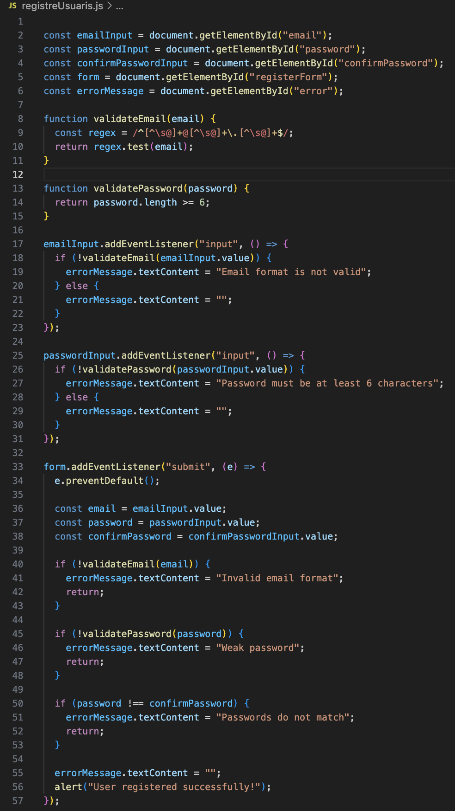

## TO DO LIST

## HISTORIA D'USUARI: "Com a usuari de la botiga online, vull poder registrar-me amb el meu correu electrònic i contrasenya per crear un compte."

1. Definir criteris d'acceptació (Llista 3-5 condicions mesurables que la funcionalitat ha de complir).
2. Escenaris de Prova amb Gherkin (Escriu 2 escenaris en sintaxi Donat/Quan/Llavors per validar els criteris).
3. Desglossament de Tasques (Divideix la història en tasques tècniques front-end específiques).
4. Organització en Tauler Kanban (Crear un tauler a trello amb aquestes columnes: Backlog | To Do | Doing | Test | Done).
   - Afegeix les tasques com a targetes i prioritza amb MoSCoW:
         🟢 Must-Have: Formulari bàsic funcional + validació inicial en enviar.
         🟡 Should-Have: Validació en temps real (errors es mostren mentre l'usuari escriu).
         🔵 Could-Have: Indicador de força de la contrasenya (barra de progrés).
         🔴 Won't-Have: Registre amb xarxes socials (Facebook/Google).
5. Documentació
   - Crea una pàgina a Notion que inclogui:
         · Història d'usuari original.
         · Criteris d'acceptació i escenaris Gherkin.
         · Enllaç al tauler Kanban.
         · Captura de pantalla del codi més complex (ex: funció de filtrat).
         · Bonus track: Repeteix l'exercici per la següent història d'usuari: ("Com a usuari registrat, vull poder canviar la meva contrasenya perquè pugui mantenir el    meu compte segur.").

### 1. Criteris d'acceptació

- Validar que el email sigui vàlid i no hi hagi cap compte creat amb aquest email.
- Validar que la contraseña cumpleixi els requisits (Una majúscula, un caràcter especial, almenys un número).
- Validar que les dues contrasenyes coincideixin.
- Validar que l'usuari rebi un correu electrònic confirmant que el seu compte ha estat creat.
- Validar que el usuari completi el captcha de forma correcte.

### 2. Escenaris de prova amb Gherkin

**Escenari: Registre exitós**
Donat que estic a la pàgina de registre
Quan introdueixo "email@exemple.com" al camp del email
I escric "P@ssw0rd" al camp de contrasenya
I completo el captcha correctament
I clico "Registrar-me"
Llavors veig el missatge "Compte creat. Verifica el teu correu electrònic."

**Escenari: Registre fallit per correu ja existent**
Donat que estic a la pàgina de registre
Quan introdueixo "email@exemple.com" al camp del email
I escric "P@ssw0rd" al camp de contrasenya
I completo el captcha correctament
I clico "Registrar-me"
Llavors veig el missatge "No s'ha pogut crear el compte. El teu correu electrònic està associat a un compte ja existent."

**Escenari: Registre fallit per contraseña incorrecte**
Quan introdueixo "email@exemple.com" al camp del email
I escric "P@ssw0rd" al camp de contrasenya
I completo el captcha correctament
I clico "Registrar-me"
Llavors veig el missatge "No s'ha pogut crear el compte. La contrasenya ha d'ncloure una majúscula, un número i un caràcter especial."

**Escenari: Registre fallit per correu incorrecte**
Quan introdueixo "email@exemple.com" al camp del email
I escric "P@ssw0rd" al camp de contrasenya
I completo el captcha correctament
I clico "Registrar-me"
Llavors veig el missatge "No s'ha pogut crear el compte. Comproba el format del correu electrònic."

### 3. Desglossament de tasques
1. Maquetar formulari de registre amb HTML/CSS (Camps d'inputs pel correu i la contrasenya, botó per confirmar el registre).
2. Crear una funció a Javascript per validar les dades introduïdes per l'usuari als inputs i mostrar els missatges d'error corresponents (Correu incorrecte, contrasenya incorrecte...).
3. Crear una funció onClick (al clicar el botó) que executi el registre de l'usuari quan aquest cliqui el botó després d'haver introduït les seves dades.
4. Executar la funció que imprimeix per HTML el missatge de "Registre exitòs" i fa saber al usuari que ha rebut un correu de confirmació al seu mail.

### 4. Organització en tauler Kanban

### 5. Documentació
Enllaç a Notion: https://www.notion.so/Tasca-S-010-Registre-d-usuaris-3478e4a98e0680658450f17ebab3e9f0?source=copy_link

# Tasca S.010 - Registre d’usuaris

Història d’usuari: "Com a usuari de la botiga online, vull poder registrar-me amb el meu correu electrònic i contrasenya per crear un compte."

## Criteris d’acceptació

- Validar que el email sigui vàlid i no hi hagi cap compte creat amb aquest email.
- Validar que la contraseña cumpleixi els requisits (Una majúscula, un caràcter especial, almenys un número).
- Validar que les dues contrasenyes coincideixin.
- Validar que l'usuari rebi un correu electrònic confirmant que el seu compte ha estat creat.
- Validar que el usuari completi el captcha de forma correcte.

## Escenaris de prova amb Gherkin

**Escenari: Registre exitós** Donat que estic a la pàgina de registre Quan introdueixo "[email@exemple.com](mailto:email@exemple.com)" al camp del email I escric "P@ssw0rd" al camp de contrasenya I completo el captcha correctament I clico "Registrar-me" Llavors veig el missatge "Compte creat. Verifica el teu correu electrònic."

**Escenari: Registre fallit per correu ja existent** Donat que estic a la pàgina de registre Quan introdueixo "[email@exemple.com](mailto:email@exemple.com)" al camp del email I escric "P@ssw0rd" al camp de contrasenya I completo el captcha correctament I clico "Registrar-me" Llavors veig el missatge "No s'ha pogut crear el compte. El teu correu electrònic està associat a un compte ja existent."

**Escenari: Registre fallit per contraseña incorrecte** Quan introdueixo "[email@exemple.com](mailto:email@exemple.com)" al camp del email I escric "P@ssw0rd" al camp de contrasenya I completo el captcha correctament I clico "Registrar-me" Llavors veig el missatge "No s'ha pogut crear el compte. La contrasenya ha d'ncloure una majúscula, un número i un caràcter especial."

**Escenari: Registre fallit per correu incorrecte** Quan introdueixo "[email@exemple.com](mailto:email@exemple.com)" al camp del email I escric "P@ssw0rd" al camp de contrasenya I completo el captcha correctament I clico "Registrar-me" Llavors veig el missatge "No s'ha pogut crear el compte. Comproba el format del correu electrònic."

## Tauler de Kanban

[https://trello.com/invite/b/69e48b85be3e54b89cd7b984/ATTIa259d607e8923678f0ddcccfbbdf9a3a85050B78/tasca-s010-registre-dusuaris](https://trello.com/invite/b/69e48b85be3e54b89cd7b984/ATTIa259d607e8923678f0ddcccfbbdf9a3a85050B78/tasca-s010-registre-dusuaris)

## Codi amb funció de filtrat

